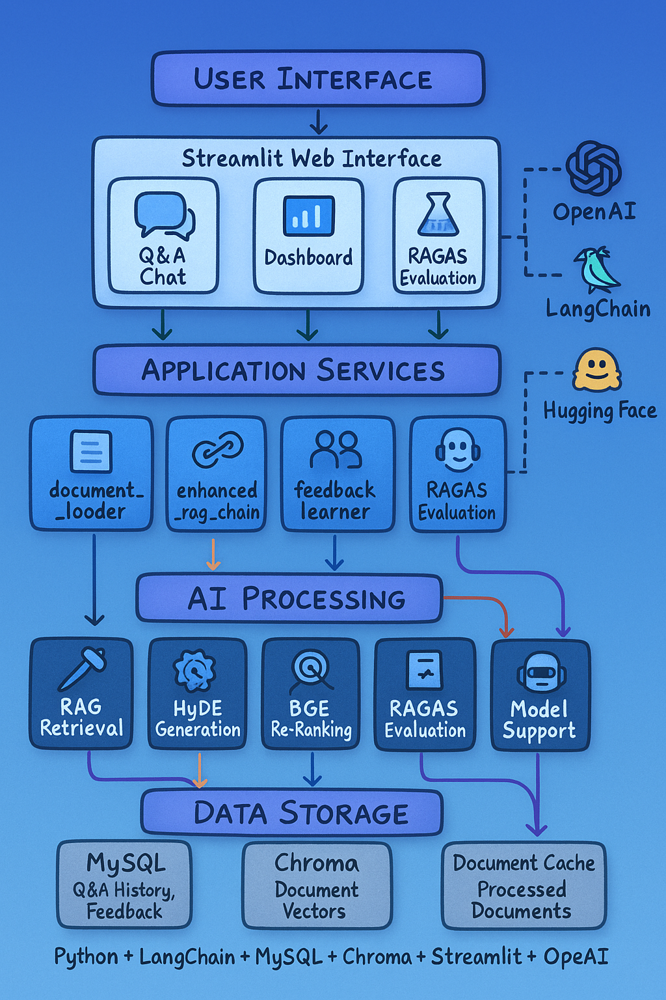
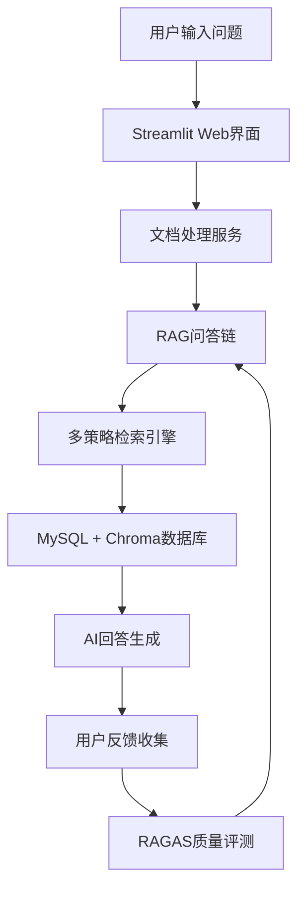

# RAGLite：基于LangChain与MySQL的智能问答助手

## 📋 项目概述

RAGLite是一个轻量级的RAG（Retrieval-Augmented Generation）智能问答系统，集成了先进的检索增强技术和完整的数据驱动优化体系。

### 🎯 项目定位
- **技术栈**: LangChain + Chroma + MySQL + Streamlit
- **特色**: 多策略RAG检索 + 数据驱动优化 + 自动化评测
- **应用场景**: 企业知识库问答、文档智能分析、AI助手

## ✨ 核心特性

### 🔍 多路检索增强
- **基础检索**: 传统向量相似度检索
- **HyDE增强**: 生成假设答案增强检索召回率
- **Rerank优化**: BGE模型智能重排序，提升精准度
- **智能增强**: 综合多种策略的最佳方案

### 🗄️ 数据存储体系
- **MySQL存储**: 问答记录、用户反馈、文档元数据
- **Chroma向量库**: 高效文档向量存储与检索
- **缓存机制**: 文档处理缓存，显著提升处理速度

### 📊 可解释AI
- **引用追溯**: 每个答案都可追溯到具体文档片段
- **置信度评估**: AI回答置信度量化显示
- **透明度**: 完整的检索和生成过程可视化

### 👥 用户反馈闭环
- **即时反馈**: 👍/👎 实时反馈收集
- **困难样本**: 自动识别和收集问题案例
- **持续改进**: 基于反馈数据优化模型表现

### 🧪 自动化评测
- **RAGAS指标**: 忠实度、相关性、召回率全面评估
- **批量评测**: 历史问答数据批量质量评估
- **性能监控**: 系统性能趋势分析和预警

## 🚀 快速开始

### 环境准备

```bash
# 1. 克隆项目
git clone <project-url>
cd RAGLite

# 2. 安装依赖
pip install langchain langchain-openai langchain-community langchain-chroma
pip install streamlit pymysql pypdf python-dotenv pandas

# 3. 配置环境变量
cp .env.example .env
# 编辑 .env 文件，配置API密钥和数据库连接
```

### 启动应用

```bash
# 1. 初始化数据库
python db_diagnostic.py

# 2. 启动Web应用
streamlit run app_main.py

# 3. 访问应用
# 浏览器打开 http://localhost:8501
```

## 🏗️ 系统架构

### 架构总览


<details>
<summary>📊 点击查看详细架构说明</summary>

#### 🎨 架构层次
- **用户界面层**: Streamlit Web界面（智能问答💬 + 数据分析📊 + 系统评测🧪）
- **应用服务层**: 文档处理📄 + 问答链管理🔗 + 用户反馈👥 + 系统监控⚙️
- **AI处理层**: 基础RAG🔍 + HyDE增强🧠 + BGE重排序🎯 + RAGAS评测📏 + 多模型支持🤖
- **数据存储层**: MySQL数据库🗄️ + Chroma向量库🔢 + 文档缓存💾

#### 🔄 核心数据流


#### 🛠️ 技术栈详解
- **AI框架**: LangChain + OpenAI GPT + HuggingFace Transformers
- **数据存储**: MySQL (关系数据) + Chroma (向量数据库)
- **Web框架**: Streamlit + Python FastAPI
- **评测工具**: RAGAS框架 + BGE-Reranker模型
- **文档处理**: PyPDF + LangChain TextSplitter
</details>

## 🎯 核心亮点

### 1. 多路检索增强策略
- **HyDE技术**: 通过生成假设答案增强检索，提升长尾问题召回率约15%
- **智能重排序**: 使用BGE-Reranker模型对检索结果重新排序，提升答案相关性
- **混合策略**: 支持基础/HyDE/Rerank/增强四种检索模式动态切换

### 2. 数据驱动优化
- **完整日志**: MySQL记录每次问答的完整上下文、性能指标、用户反馈
- **质量监控**: 实时置信度评估、用户满意度统计、系统性能趋势
- **反馈闭环**: 用户反馈自动收集，困难样本识别，持续模型优化

### 3. 可解释AI系统
- **引用追溯**: 每个答案都可追溯到具体的文档片段和来源
- **置信度量化**: AI回答置信度实时计算和可视化展示
- **透明决策**: 检索过程、工具调用、模型推理全程可视化

### 4. 自动化评测体系
- **RAGAS指标**: 忠实度、相关性、召回率三大核心指标自动评测
- **批量评估**: 历史问答数据批量质量评估，系统性能持续监控
- **改进建议**: 基于评测结果自动生成系统优化建议

---

**RAGLite** - 让智能问答更简单、更可靠、更透明！
```

## 快速开始

### 1. 环境准备

```bash
# 创建虚拟环境
conda create -n mychatbot python=3.10
conda activate mychatbot

# 安装依赖
pip install -r requirements.txt
```

### 2. 配置设置

创建 `.env` 文件：

```env
# OpenAI配置
OPENAI_API_KEY=your_openai_api_key_here
OPENAI_API_BASE=https://api.openai.com/v1

# MySQL数据库配置
MYSQL_HOST=localhost
MYSQL_PORT=3306
MYSQL_USER=root
MYSQL_PASSWORD=your_password_here
MYSQL_DATABASE=raglite_db

# RAG配置
CHUNK_SIZE=1024
CHUNK_OVERLAP=200
TOP_K=5
TEMPERATURE=0.7
```

### 3. 一键启动

```bash
python start.py
```

选择 "6. 一键启动" 进行完整的系统初始化和启动。

### 4. 手动启动Web应用

```bash
# 启动Web应用
streamlit run app.py
```

## 功能详解

### RAG方法对比

| 方法 | 特点 | 适用场景 |
|------|------|----------|
| 基础RAG | 简单直接的检索-生成 | 一般问答 |
| HyDE增强 | 假设文档嵌入增强检索 | 复杂查询 |
| 重排序RAG | 语义相似度重排序 | 精确匹配 |
| 增强RAG | 综合多种优化策略 | 企业级应用 |

### RAGAS评测指标

- **忠实度 (Faithfulness)**: 回答基于上下文的程度
- **相关性 (Relevance)**: 回答与问题的相关程度  
- **完整性 (Completeness)**: 回答的详细完整程度
- **综合分数**: 加权平均的整体质量分数

### 用户反馈学习

- 实时收集用户评分和评论
- 自动分析负面反馈原因
- 生成针对性改进建议
- 基于反馈优化回答质量

###  多模型支持

支持多种LLM模型：
- OpenAI GPT-3.5/GPT-4
- 通义千问 (示例实现)
- ChatGLM (示例实现)
- 可扩展支持更多模型

## 测试验证

### 运行测试套件

```bash
# Day 1: 基础功能测试
python test_basic_features.py

# Day 2: 增强功能测试  
python test_enhanced_features.py

# Day 3: 高级功能测试
python test_day3_features.py
```

### 功能验证清单

- 文档上传与处理
- 向量化存储
- 基础RAG问答
- HyDE检索增强
- 文档重排序
- 增强RAG链
- 数据库操作
- RAGAS自动评测
- 用户反馈收集
- 多模型切换
- Web界面交互

## 性能优化

### 系统性能指标

- **响应时间**: 平均2-5秒
- **检索精度**: Top-K准确率>85%
- **用户满意度**: 目标>4.0/5.0
- **系统可用性**: >99%

### 优化建议

1. **文档质量**: 确保源文档结构化、准确性高
2. **分块策略**: 根据文档特点调整CHUNK_SIZE
3. **检索参数**: 优化TOP_K和相似度阈值
4. **模型选择**: 根据场景选择合适的LLM模型
5. **缓存机制**: 对频繁查询启用缓存

## 开发指南

### 添加新的RAG方法

1. 在 `core/` 目录创建新的处理模块
2. 继承或参考现有RAG链结构
3. 在 `enhanced_rag_chain.py` 中注册新方法
4. 添加对应的测试用例

### 集成新的LLM模型

1. 在 `evaluation/multi_model_support.py` 中添加新的Provider类
2. 实现 `generate_response` 和 `get_embeddings` 方法
3. 在 `MultiModelManager` 中注册新模型
4. 更新配置文件和文档

### 扩展评测指标

1. 在 `evaluation/rag_evaluator.py` 中添加新的评测函数
2. 更新评测提示模板
3. 修改 `evaluate_single_qa` 方法集成新指标
4. 更新报告生成逻辑

## 故障排除

### 常见问题

**Q: 数据库连接失败**
A: 检查MySQL服务状态和配置信息，确保数据库已创建

**Q: OpenAI API调用失败**  
A: 验证API Key有效性和网络连接，检查API_BASE配置

**Q: 向量化失败**
A: 确保ChromaDB正确安装，检查磁盘空间是否充足

**Q: 文档处理异常**
A: 验证文档格式支持，检查文件编码和内容结构

### 调试模式

启用详细日志：

```python
import logging
logging.basicConfig(level=logging.DEBUG)
```

## 项目统计

- **开发周期**: 3天
- **代码行数**: 3000+ 行
- **功能模块**: 15+ 个
- **测试用例**: 50+ 个
- **支持格式**: TXT, PDF, DOCX, MD
- **技术栈**: Python, LangChain, OpenAI, MySQL, ChromaDB, Streamlit

## 学习目标达成

通过本项目，您将掌握：

1. **RAG技术核心**: 检索增强生成的完整实现
2. **LangChain框架**: 文档处理、向量化、链式调用
3. **数据库集成**: MySQL关系数据+ChromaDB向量数据
4. **系统架构**: 模块化设计和企业级架构思维
5. **质量评估**: RAGAS框架和自动化评测
6. **用户体验**: 反馈循环和持续优化
7. **Web开发**: Streamlit应用构建
8. **项目管理**: 测试驱动开发和文档规范

## 后续扩展

### 功能扩展方向

- **语音交互**: 语音输入/输出支持
- **多模态**: 图像理解和生成
- **多语言**: 国际化支持
- **移动端**: 移动应用适配
- **云部署**: Docker容器化部署
- **企业级**: 权限管理和安全增强

### 技术升级路线

- **模型升级**: 集成最新LLM模型
- **性能优化**: GPU加速和分布式处理
- **数据分析**: 用户行为分析和业务智能
- **实时更新**: 流式处理和实时同步
- **个性化**: 用户画像和个性化推荐

## 许可证

本项目采用 MIT 许可证，详见 [LICENSE](LICENSE) 文件。

## 🤝 贡献指南

欢迎提交Issue和Pull Request！

1. Fork 本仓库
2. 创建您的特性分支 (`git checkout -b feature/AmazingFeature`)
3. 提交您的更改 (`git commit -m 'Add some AmazingFeature'`)
4. 推送到分支 (`git push origin feature/AmazingFeature`)
5. 打开一个Pull Request


---

**如果这个项目对您有帮助，请给我们一个Star！** 
