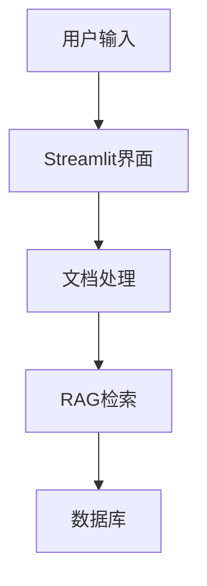

# 架构图说明

## 如何添加架构图到README

### 方法1: 本地图片文件
1. 将架构图保存为 `architecture.png` 
2. 放置在 `docs/` 目录下
3. README中使用相对路径引用：
   ```markdown
   
   ```

### 方法2: GitHub Issues上传
1. 创建一个GitHub Issue
2. 拖拽图片到Issue编辑框
3. 复制生成的图片URL
4. 在README中使用：
   ```markdown
   
   ```

### 方法3: 在线图床
1. 上传到图床服务（如：imgur、sm.ms等）
2. 获取直链URL
3. 在README中引用

### 方法4: Mermaid流程图
直接在README中使用Mermaid语法绘制：


## 推荐使用方法1或方法2
- 方法1：适合高质量的架构图
- 方法2：GitHub原生支持，稳定可靠
